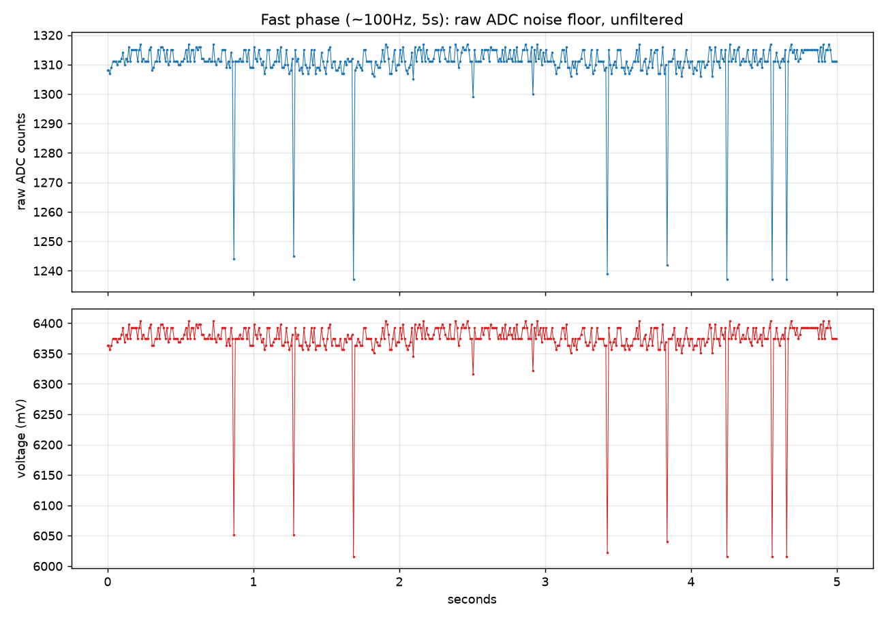
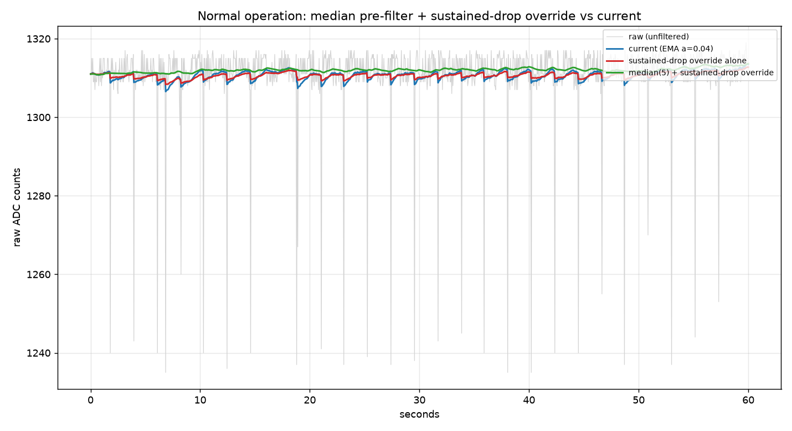
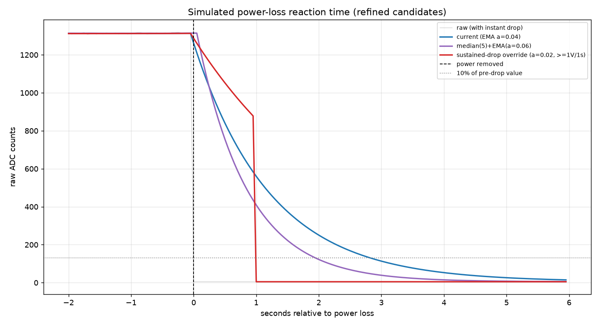

# Battery ADC Noise Investigation — 2026-07-09

**Status:** Resolved. Fix implemented in `drv_battery_monitor` (px-components v0.8) and
`prop_engine.c` (px-wifi-v1 v0.3).

## Background

After switching the live device's battery profile from `unknown` to `6v-lead-acid`, the
displayed battery voltage/percentage was noticeably jumping around during normal
operation (charging + running), more than expected. A prior change had increased the
battery ADC sample rate from ~1/sec to ~10/sec (every ~100ms) to catch a sudden power-loss
drop to ~0V quickly, but this also widened the EMA filter's real-time noise bandwidth by
~10x, which was suspected as a contributing factor.

Two incremental fixes were tried first and helped some, but the user still saw excessive
jitter after both:

1. Lowered `BATTERY_ADC_EMA_ALPHA` from `0.15` to `0.04` (slower filter, still ~10x faster
   settling than the theoretical "safe" bound before deep-sleep cutoffs would trigger).
2. Added 16x ADC oversampling per sample in `drv_battery_monitor` (averages 16 back-to-back
   raw reads before the EMA, reducing per-sample ADC noise by ~sqrt(16) ≈ 4x at the source).

Rather than keep guessing at filter constants, we built a temporary data-collection
feature into the firmware, captured real waveform data at three different rates/
durations, and used that data to evaluate several candidate filtering approaches
*before* committing to one.

## Requirements

- Under normal operation (including charging), the displayed percentage should rarely
  drop while charging or rise while discharging (i.e., should track the true trend
  smoothly).
- If power is genuinely removed, the reading should still reflect that within **5
  seconds** — this is the intentional exception to "smooth", not the common case.

## Method: temporary in-firmware data capture

A temporary HTTP-triggered capture (`POST /api/battery/diag/start`, `GET .../status`,
`GET .../csv` — removed after this investigation) sampled the **raw, unfiltered** ADC
reading (bypassing oversampling and the EMA entirely, via a small diagnostic read
function) at three rates/durations chosen to see different timescales of behavior:

| Phase | Rate | Duration | Samples | Purpose |
|---|---|---|---|---|
| fast | ~100Hz (10ms) | 5s | 501 | True waveform/noise floor |
| medium | ~20Hz (50ms) | 60s | 1201 | Normal short-term behavior |
| slow | ~2Hz (500ms) | 300s | 601 | Longer-term drift/ripple |

While a capture ran, the normal EMA-based sampling in the main timer task was paused so
only one task accessed the ADC at a time. Total capture time: ~6 minutes, 2303 samples.
Raw data: [`battery_diag_raw.csv`](battery_diag_raw.csv).

## Key finding: the noise is not symmetric

Plotting the fast-phase (highest resolution) raw data revealed the "noise" is not
generic symmetric ADC/thermal noise — it's **periodic, one-directional impulse
dropouts**, dipping ~300–340mV and snapping right back, recurring roughly every
0.3–0.5 seconds:

This pattern (brief, always-downward, recurring) is consistent with **transient
current-draw sag** — most likely WiFi TX bursts (or possibly LED/buzzer activity)
briefly loading the battery/sense rail, caught mid-dip by an ADC read. The same dip
magnitude appeared consistently across all three capture rates:

| Phase | Raw stdev (counts) | Raw p2p (counts) | mV stdev | mV p2p |
|---|---|---|---|---|
| fast (100Hz/5s) | 9.47 | 80 | 45.8 | 388 |
| medium (20Hz/60s) | 10.93 | 84 | 52.9 | 411 |
| slow (2Hz/300s) | 10.64 | 84 | 51.7 | 411 |

This mattered a lot for picking the right fix: a median filter specifically excels at
rejecting isolated impulse spikes (as long as they don't cluster 3+ samples in a row),
whereas a plain EMA/moving-average cannot distinguish an impulse from a genuine signal
change — it can only trade reaction speed for smoothness.

## Candidates tested (simulated offline against the same captured data)

Analysis scripts: [`battery_diag_analyze.py`](battery_diag_analyze.py) (initial pass),
[`battery_diag_analyze_v2.py`](battery_diag_analyze_v2.py) (refined sustained-drop
design), [`battery_diag_analyze_v3.py`](battery_diag_analyze_v3.py) (final combined
candidate).

| Approach | Steady-state stdev | Steady-state p2p | Reaction to simulated power loss |
|---|---|---|---|
| Current at the time (EMA α=0.04) | 5.5 mV | 34.2 mV | 2.85s |
| Lower α (0.015) | ~2.8 mV (est.) | ~17.7 mV | **Did not reach 10% within 5s** ❌ |
| Moving average (1s window) | worse than current | worse | — |
| Median(5) + EMA(α=0.06) | 3.9 mV | 19.9 mV | 1.95s |
| Naive fast-attack (single-sample threshold) | **10.4 stdev — worse than current** | 51.7 | 0.15s |
| Sustained-drop override alone (≥1V drop sustained ≥1s → snap) | 3.4 mV | 21.6 mV | 1.00s |
| **Median(5) + sustained-drop override (chosen)** | **2.5 mV** | **13.6 mV** | **1.10s** |

A naive "react fast to any large single-sample change" filter was tried and explicitly
**rejected** — it performed *worse* than doing nothing (stdev 10.4 vs. 5.5 for the
baseline), because normal impulse noise occasionally exceeds any per-sample threshold
low enough to react quickly. Requiring the drop to be **sustained across a time
window** (not just a single sample) is what makes a fast-reacting override safe: at
≈19 standard deviations away from normal noise, it essentially never false-triggers,
while still reacting far faster than the 5-second requirement.

Normal-operation comparison (gray = raw, blue = plain EMA, red = sustained-drop-override
alone, green = median + sustained-drop-override):

Power-loss reaction time (red/green snap down at ~1s; the plain EMA takes several
seconds to fully settle):

## Chosen fix

**Median-of-5 pre-filter feeding a sustained-drop-override EMA**, layered on top of the
existing 16x oversampling:

1. Oversample: average 16 back-to-back raw ADC reads per ~100ms sample (unchanged,
   already in place).
2. **Median-of-5** pre-filter: rejects the isolated current-sag impulses before they
   ever reach the smoothing filter.
3. EMA with baseline α≈0.02 for normal operation (smoother than the interim 0.04).
4. **Sustained-drop override:** if readings stay ≥1V below the current filtered value
   for a full continuous second, snap immediately to the recent average instead of
   creeping down via the EMA.

Net effect vs. the interim (EMA-only, α=0.04) fix: **~2.5x smoother steady-state
reading** (13.6mV peak-to-peak vs. 34.2mV) while reacting to genuine power loss **~2.6x
faster** (1.1s vs 2.85s) — better on both axes simultaneously, because it targets the
actual root cause (impulse noise) instead of trading speed for smoothness along a single
EMA knob.

### Implementation

- `px-components/drv_battery_monitor` (v0.8): added `median_window`,
  `drop_threshold_raw`, `drop_sustain_ms` config fields and
  `drv_battery_monitor_set_drop_threshold_raw()` for runtime updates. Generic/reusable —
  expressed in raw ADC counts (the driver still doesn't know about voltage dividers or
  calibration), so any future prop using this component can tune the same knobs to its
  own noise characteristics.
- `px-wifi-v1/main/prop_engine.c` (v0.3): configures `BATTERY_ADC_MEDIAN_WINDOW` (5),
  `BATTERY_ADC_DROP_THRESHOLD_MV` (1000), `BATTERY_ADC_DROP_SUSTAIN_MS` (1000), and keeps
  the raw-count threshold in sync with the live voltage calibration every cycle via
  `battery_drop_threshold_raw_for_mv()`.
- The temporary diagnostic capture code (`battery_diag_*` in `prop_engine.c`/`.h`, the
  `/api/battery/diag/*` routes in `web_ui.c`) was removed after this investigation. The
  small `drv_battery_monitor_read_instant_raw()` diagnostic helper was kept in the driver
  (harmless, read-only, useful for future debugging).

## Will this still work if the underlying electrical issue is fixed?

Yes, gracefully. If a future board revision addresses the root cause (e.g. a bypass
capacitor at the ADC sense point to reduce current-draw-sag coupling), the median filter
simply has less to reject (converges to behaving like a plain average when there's no
noise), and the sustained-drop override just sits idle until a genuine multi-second
voltage drop occurs. Nothing about the design assumes the noise is present — it only
takes advantage of the noise's shape (brief, one-directional) when it is.

## Hardware note (not actioned here)

The root cause (periodic current-draw sag, most likely from WiFi TX activity) is a
hardware/board-layout phenomenon. A small bypass capacitor at the ADC sense point on a
future board revision could reduce this noise before it ever reaches software. Not
pursued in this firmware-only session — noted here for whoever next revises the board
for `px-wifi-v1` or designs a new device sharing this divider/sense circuit.

## Files in this folder

- `battery_diag_raw.csv` — raw captured data (phase, elapsed_ms, raw ADC counts, voltage mV).
- `battery_diag_analyze.py`, `_v2.py`, `_v3.py` — analysis/simulation scripts (Python 3,
  requires `matplotlib`/`numpy`/`pandas` — none of these need ESP-IDF, they operate purely
  on the captured CSV).
- `battery_diag_fast_phase.png`, `battery_diag_medium_candidates.png`,
  `battery_diag_slow_phase.png`, `battery_diag_v2_normal.png`,
  `battery_diag_v2_dropoff.png`, `battery_diag_v3_combined.png` — generated charts.
