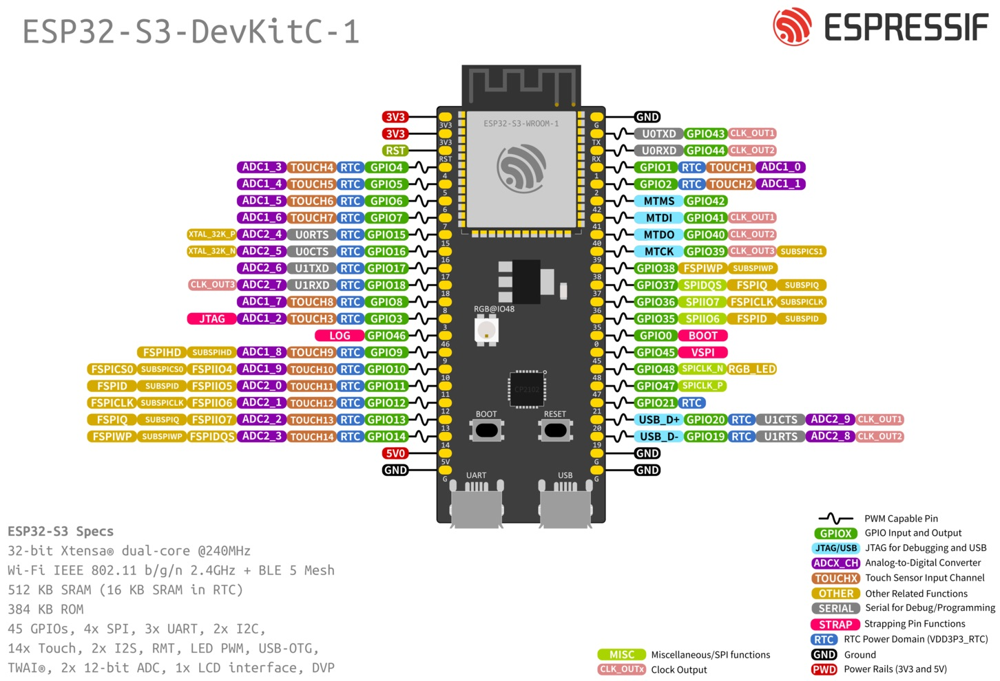

# PX-WiFi-V1 — Pin Mapping

Reference: https://docs.espressif.com/projects/esp-dev-kits/en/latest/esp32s3/esp32-s3-devkitc-1/user_guide_v1.0.html

This file maps project pin aliases to physical hardware for each supported board.
Firmware references only these aliases. The board mapping layer resolves aliases to GPIO values.

---

## GPIO Availability — ESP32-S3-DevKitC-1 v1.0

The ESP32-S3 chip has GPIO 0–48 (49 total). On the WROOM-1 module and DevKitC-1 board, many are consumed:

| Category | GPIOs | Count | Notes |
|----------|-------|-------|-------|
| SPI Flash (internal) | 26–32 | 7 | Not exposed on WROOM-1 module |
| PSRAM (internal) | 33–37 | 5 | Octal SPI PSRAM on -N8R8 variant |
| Not routed on module | 22–25 | 4 | Not bonded to WROOM-1 pads |
| USB-Serial/JTAG | 19, 20 | 2 | Built-in USB on DevKitC-1 |
| Onboard RGB LED | 48 | 1 | WS2812 on DevKitC-1 v1.0 |
| **Subtotal unavailable** | | **19** | |
| Strapping (usable with caution) | 0, 3, 45, 46 | 4 | See notes below |
| UART0 (free if USB console) | 43, 44 | 2 | Default console is USB, so these are available |
| **Clean GPIOs** | 1–2, 4–18, 21, 38–44, 47 | **26** | No gotchas, fully general purpose |

**Strapping pin details:**
- **GPIO 0** — Boot mode. Internal pull-up. LOW at reset = download mode. Avoid connecting anything that could pull it low during power-on.
- **GPIO 3** — JTAG source select. Internal pull-up. LOW = USB-JTAG. Safe to use after boot, but external pull-down during reset could change JTAG routing.
- **GPIO 45** — VDD_SPI voltage. Internal pull-down. Must be LOW at reset for 3.3V flash. Safe to drive after boot.
- **GPIO 46** — ROM log printing / boot mode. **Input-only.** Internal pull-down. Safe to read after boot.

**Bottom line: 26 fully clean GPIOs available.** Plus 3 strapping pins usable as outputs after boot, and 1 strapping pin usable as input only. Total usable: 30.

---

## Pin Mapping — DevKitC-1 v1.0

| Pin Name | ESP-IDF Constant | DevKitC-1 Header Label | ADC Channel | Function Group |
|----------|-----------------|----------------------|-------------|----------------|
| `RED_WIRE` | `GPIO_NUM_4` | 4 | ADC1_CH3 | Wire input |
| `GRN_WIRE` | `GPIO_NUM_5` | 5 | ADC1_CH4 | Wire input |
| `YLW_WIRE` | `GPIO_NUM_6` | 6 | ADC1_CH5 | Wire input |
| `BLU_WIRE` | `GPIO_NUM_7` | 7 | ADC1_CH6 | Wire input |
| `AUX_IN_1` | `GPIO_NUM_15` | 15 | ADC2_CH4 | Digital input |
| `AUX_IN_2` | `GPIO_NUM_16` | 16 | ADC2_CH5 | Digital input |
| `AUX_IN_3` | `GPIO_NUM_17` | 17 | ADC2_CH6 | Digital input |
| `LID_SWITCH` | `GPIO_NUM_18` | 18 | ADC2_CH7 | Lid/tamper input |
| `AUX_OUT_1` | `GPIO_NUM_38` | 38 | — | Low-power output |
| `AUX_OUT_2` | `GPIO_NUM_39` | 39 | — | Low-power output |
| `AUX_OUT_3` | `GPIO_NUM_40` | 40 | — | Low-power output |
| `AUX_OUT_4` | `GPIO_NUM_41` | 41 | — | Low-power output |
| `PIEZO_PWM` | `GPIO_NUM_14` | 14 | ADC2_CH3 | PWM audio output |
| `BATT_SENSE` | `GPIO_NUM_9` | 9 | ADC1_CH8 | Battery voltage sense via 21.6 kOhm / 4.43 kOhm divider |
| `I2C_SDA` | `GPIO_NUM_1` | 1 | ADC1_CH0 | I2C data |
| `I2C_SCL` | `GPIO_NUM_2` | 2 | ADC1_CH1 | I2C clock |
| `SPI_MOSI` | `GPIO_NUM_11` | 11 | ADC2_CH0 | SPI data out |
| `SPI_MISO` | `GPIO_NUM_13` | 13 | ADC2_CH2 | SPI data in |
| `SPI_SCLK` | `GPIO_NUM_12` | 12 | ADC2_CH1 | SPI clock |
| `SPI_CS` | `GPIO_NUM_10` | 10 | ADC1_CH9 | SPI chip select |
| `WIRE_GND_DRV` | `GPIO_NUM_8` | 8 | ADC1_CH7 | Wire harness common return (output LOW) |
| `AUX_GPIO_2` | `GPIO_NUM_21` | 21 | — | General-purpose AUX GPIO |
| `AUX_GPIO_3` | `GPIO_NUM_47` | 47 | — | General-purpose AUX GPIO |
| `STATUS_LED` | `GPIO_NUM_48` | 48 | — | Status LED (WS2812) |
| `USB_DP` | `GPIO_NUM_20` | 20 | — | USB D+ (reserved) |
| `USB_DM` | `GPIO_NUM_19` | 19 | — | USB D- (reserved) |

**Pins used:** 26 of 26 clean GPIOs.

**Remaining spare GPIOs:** 42, 43, 44 (3 spare — available for future expansion).

---

## Assignment Rationale

- **RED/GRN/YLW/BLU wires on GPIO 4–7:** Sequential block in the low-numbered range. ADC-capable, which allows analog sensing (e.g., detecting partial wire connections or variable resistance inputs in future puzzles).
- **AUX_IN_1..3 + LID_SWITCH on GPIO 15–18:** Sequential block. ADC2-capable (note: ADC2 cannot be used while WiFi is active, but these are digital inputs so it doesn't matter).
- **AUX_OUT_1..4 on GPIO 38–41:** High-numbered GPIOs with no ADC capability — no waste assigning them to digital outputs. Sequential block for clean wiring.
- **PIEZO_PWM on GPIO 14:** Clean general-purpose GPIO with LEDC support. ADC2 capability is irrelevant for PWM output.
- **BATT_SENSE on GPIO 9:** ADC1_CH8 — on ADC1 which works alongside WiFi (unlike ADC2). Divider is R1 = 21.6 kOhm high-side and R2 = 4.43 kOhm low-side, so 15V input appears as about 2.55V at the pin.
- **I2C on GPIO 1–2:** Matches the DevKitC-1 default and common ESP32-S3 convention.
- **SPI on GPIO 10–13:** Matches the DevKitC-1 default and common ESP32-S3 convention.
- **Wire ground drive on GPIO 8:** Dedicated low-side return for the wire harness, configured as output LOW at startup.
- **AUX GPIO expansion:** GPIO 21 and 47 remain available as general-purpose AUX GPIOs.

### GPIO notes (GPIO 8, 21, 47)

- **GPIO 8:** No strapping or boot-mode caveats. Reserved in this revision as `WIRE_GND_DRV` and driven LOW.
- **GPIO 21:** No strapping caveats; safe as general-purpose input/output.
- **GPIO 47:** No strapping caveats; safe as general-purpose input/output. No ADC capability.

---

## DevKitC-1 Pin Layout

| Use | Pin Name | Pin Label |x| Pin Label | Pin Name | Use |
|-----|----------|-----------|---|-----------|----------|-----|
| 3.3v PWR Out | - | 3V3 |x| GND | - | Ground |
| 3.3v PWR Out | - | 3V3 |x| GPIO43 | - | Spare / UART0 TX |
| Reset | - | RST |x| GPIO44 | - | Spare / UART0 RX |
| Red Wire | RED_WIRE | GPIO4 |x| GPIO1 | I2C_SDA | I2C SDA |
| Green Wire | GRN_WIRE | GPIO5 |x| GPIO2 | I2C_SCL | I2C SCL |
| Yellow Wire | YLW_WIRE | GPIO6 |x| GPIO42 | - | Spare |
| Blue Wire | BLU_WIRE | GPIO7 |x| GPIO41 | AUX_OUT_4 | Output 4 |
| Aux Input 1 | AUX_IN_1 | GPIO15 |x| GPIO40 | AUX_OUT_3 | Output 3 |
| Aux Input 2 | AUX_IN_2 | GPIO16 |x| GPIO39 | AUX_OUT_2 | Output 2 |
| Aux Input 3 | AUX_IN_3 | GPIO17 |x| GPIO38 | AUX_OUT_1 | Output 1 |
| Lid Switch | LID_SWITCH | GPIO18 |x| GPIO37 | - | Module internal |
| Wire Ground Drive | WIRE_GND_DRV | GPIO8 |x| GPIO36 | - | Module internal |
| Strap / Reserved | - | GPIO3 |x| GPIO35 | - | Module internal |
| Input-only Strap | - | GPIO46 |x| GPIO0 | - | Boot strap |
| Battery Sense | BATT_SENSE | GPIO9 |x| GPIO45 | - | Strap / reserved |
| SPI CS | SPI_CS | GPIO10 |x| GPIO48 | STATUS_LED | WS2812 LED |
| SPI MOSI | SPI_MOSI | GPIO11 |x| GPIO47 | AUX_GPIO_3 | Aux GPIO 3 |
| SPI SCLK | SPI_SCLK | GPIO12 |x| GPIO21 | AUX_GPIO_2 | Aux GPIO 2 |
| SPI MISO | SPI_MISO | GPIO13 |x| GPIO20 | USB_DP | USB D+ |
| Buzzer PWM | PIEZO_PWM | GPIO14 |x| GPIO19 | USB_DM | USB D- |
| 5V PWR In/Out | - | 5V |x| GND | - | Ground |
| Ground | - | GND |x| GND | - | Ground |

### Table Legend

| Label | Meaning |
|-------|---------|
| `|x|` | Visual center divider between left and right board headers |
| `-` | Not assigned in this board profile or not applicable |
| `Module internal` | GPIO exists on chip but is not available on the DevKitC-1 header |
| `Strap / reserved` | Boot strapping pin; avoid external loads that can change reset behavior |
| `Input-only Strap` | Strapping pin with input-only behavior |

## DevKitC-1 (v1.0) Pinout Diagram

